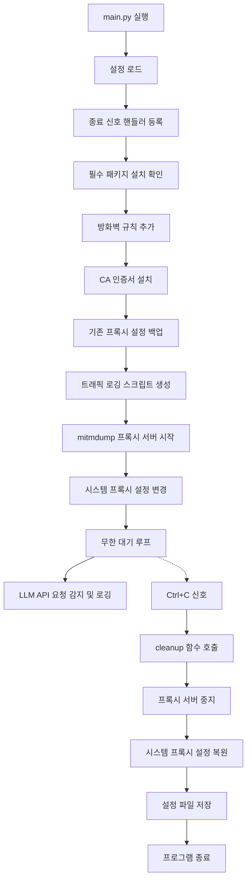

# LLM 프록시 매니저 분석

## 📁 프로젝트 구조

```
llm_proxy/
├── main.py              # 메인 실행 파일 (콘솔 전용)
├── proxy_manager.py     # 프록시 서버 관리
├── traffic_logger.py    # LLM 트래픽 로깅
└── firewall_manager.py  # Windows 방화벽 규칙 관리
```

## 🔍 각 파일별 주요 기능

### 1. main.py (메인 애플리케이션)
**역할**: 전체 시스템의 진입점이자 오케스트레이터

**주요 기능**:
- 애플리케이션 초기화 및 설정 관리
- Ctrl+C 신호 처리를 통한 안전한 종료
- 필수 패키지(`mitmproxy`) 자동 설치
- 컴포넌트들 간의 협조 관리
- 설정 파일 저장/로드 (`~/.llm_proxy/config.json`)
- 전체 시스템의 생명주기 관리

**핵심 메서드**:
- `auto_setup_and_run()`: 전체 자동 설정 및 실행
- `cleanup()`: 프로그램 종료 시 모든 설정 원상 복구
- `signal_handler()`: Ctrl+C 처리

### 2. proxy_manager.py (프록시 관리)
**역할**: mitmproxy 실행 및 시스템 프록시 설정 담당

**주요 기능**:
- mitmproxy(mitmdump) 실행 파일 자동 탐지
- 프록시 서버 시작/중지 (포트: 동적 할당)
- Windows 시스템 프록시 설정/복원
- CA 인증서 Windows 신뢰된 루트 저장소 자동 설치
- 기존 프록시 설정 백업 및 복원

**핵심 메서드**:
- `start_proxy()`: mitmdump 백그라운드 프로세스 실행
- `stop_proxy()`: 프록시 프로세스 안전 종료
- `install_certificate()`: mitmproxy CA 인증서 설치
- `set_system_proxy_windows()`: Windows 레지스트리 프록시 설정

### 3. traffic_logger.py (트래픽 로깅)
**역할**: 특정 LLM 서비스 트래픽만 선별하여 로깅

**주요 기능**:
- LLM 서비스 호스트 필터링 (OpenAI, Anthropic, Google 등)
- mitmproxy 스크립트 동적 생성
- JSON 형태로 요청/응답 로깅
- Gemini 프롬프트 특별 파싱 로직

**감지 대상 서비스**:
- OpenAI/ChatGPT: `api.openai.com`, `chatgpt.com`
- Anthropic/Claude: `api.anthropic.com`, `claude.ai`
- Google/Gemini: `generativelanguage.googleapis.com`, `gemini.google.com`
- 기타: Groq, Cohere, DeepSeek

**핵심 메서드**:
- `create_llm_logger_script()`: mitmproxy 로깅 스크립트 생성
- `parse_gemini_prompt()`: Gemini 요청에서 프롬프트 추출

### 4. firewall_manager.py (방화벽 관리)
**역할**: Windows Defender 방화벽 규칙 자동 관리

**주요 기능**:
- 관리자 권한 확인
- mitmdump.exe에 대한 인바운드 허용 규칙 추가
- 기존 규칙 중복 확인
- netsh 명령어를 통한 방화벽 설정

**핵심 메서드**:
- `is_admin()`: 관리자 권한 확인
- `add_inbound_rule_for_program()`: 프로그램별 방화벽 규칙 추가

## 🔄 전체 시스템 로직 흐름



## 🛠️ 컴포넌트 간 연결 관계

1. **main.py** ← **중앙 통제**
   - `ProxyManager` 인스턴스로 프록시 관리
   - `TrafficLogger` 인스턴스로 로깅 스크립트 생성
   - `FirewallManager` 인스턴스로 방화벽 설정

2. **proxy_manager.py** ← **시스템 레벨 설정**
   - Windows 레지스트리 직접 조작
   - mitmproxy 프로세스 관리
   - 인증서 시스템 설치

3. **traffic_logger.py** ← **비즈니스 로직**
   - 특정 LLM 서비스만 필터링
   - 동적 mitmproxy 스크립트 생성

4. **firewall_manager.py** ← **보안 설정**
   - 관리자 권한 확인
   - 네트워크 보안 규칙 관리

## 📝 데이터 흐름

1. **설정 데이터**: `~/.llm_proxy/config.json`
2. **로그 데이터**: `~/.llm_proxy/llm_requests.json`
3. **CA 인증서**: `~/.llm_proxy/.mitmproxy/mitmproxy-ca-cert.pem`
4. **디버그 로그**: `~/.llm_proxy/mitm_debug.log`

---

# LLM 프록시 매니저

> **완전 자동화된 LLM API 트래픽 감지 및 로깅 시스템**

OpenAI, Anthropic, Google Gemini 등 주요 LLM 서비스의 API 호출을 실시간으로 감지하고 로깅하는 프록시 도구입니다.

## ✨ 주요 기능

- 🔍 **선택적 트래픽 감지**: 지정된 LLM 서비스만 모니터링
- 🔒 **자동 인증서 관리**: mitmproxy CA 인증서 자동 설치
- 🛡️ **방화벽 자동 설정**: Windows Defender 규칙 자동 추가
- 💾 **JSON 로깅**: 구조화된 요청/응답 데이터 저장
- 🔄 **안전한 복원**: Ctrl+C로 모든 설정 원상 복구

## 🚀 빠른 시작

### 사전 요구사항
- Windows 10/11 (관리자 권한 필요)
- Python 3.7+

### 설치 및 실행

1. **저장소 클론**
```bash
git clone <repository-url>
cd llm-proxy-manager
```

2. **프로그램 실행** (관리자 권한으로)
```bash
python main.py
```

3. **종료**: `Ctrl+C`로 안전하게 종료

## 📊 지원하는 LLM 서비스

| 서비스 | 도메인 | 특수 기능 |
|--------|--------|-----------|
| **OpenAI** | `api.openai.com`, `chatgpt.com` | ✅ |
| **Anthropic** | `api.anthropic.com`, `claude.ai` | ✅ |
| **Google Gemini** | `generativelanguage.googleapis.com`, `gemini.google.com` | 🎯 프롬프트 파싱 |
| **Groq** | `api.groq.com` | ✅ |
| **Cohere** | `api.cohere.ai` | ✅ |
| **DeepSeek** | `api.deepseek.com` | ✅ |

## 📁 파일 구조

```
~/.llm_proxy/
├── config.json              # 설정 파일
├── llm_requests.json         # LLM API 로그 (JSON)
├── proxy_manager.log         # 시스템 로그
├── mitm_debug.log           # mitmproxy 디버그 로그
├── llm_logger.py            # 동적 생성된 로깅 스크립트
└── .mitmproxy/
    └── mitmproxy-ca-cert.pem # CA 인증서
```

## ⚙️ 작동 원리

1. **프록시 서버 시작**: 동적 포트에 mitmproxy 실행
2. **시스템 프록시 설정**: Windows 레지스트리 수정으로 모든 트래픽 경유
3. **트래픽 필터링**: 지정된 LLM 도메인만 로깅
4. **데이터 추출**: 요청/응답 JSON 파싱 및 저장

## 🛡️ 보안 고려사항

- **CA 인증서**: HTTPS 트래픽 복호화를 위해 시스템에 설치
- **방화벽 규칙**: mitmdump.exe 인바운드 허용 규칙 자동 추가
- **관리자 권한**: 시스템 레벨 설정 변경을 위해 필요


## ⚠️ 주의사항

- **관리자 권한** 필요 (방화벽 및 인증서 설정)
- **안티바이러스 소프트웨어**에서 차단될 수 있음
- **회사 네트워크** 환경에서는 추가 설정이 필요할 수 있음
- 종료 시 반드시 **Ctrl+C**를 사용하여 설정을 복원해야 함


---

**⚡ 주의**: 이 도구는 교육 및 개발 목적으로만 사용해야 하며, 관련 서비스의 이용약관을 준수해야 합니다.
